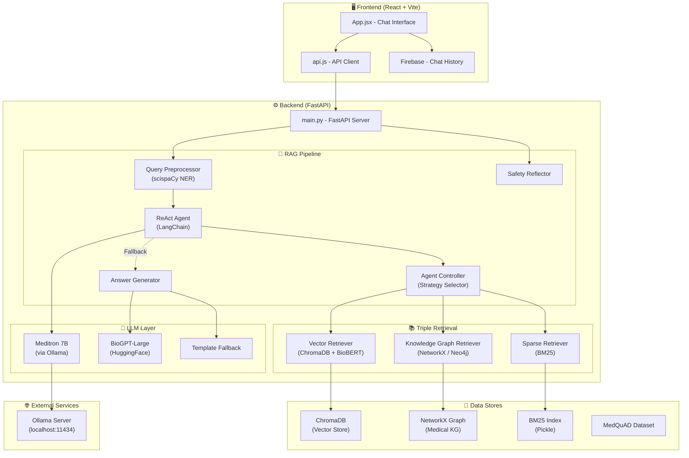
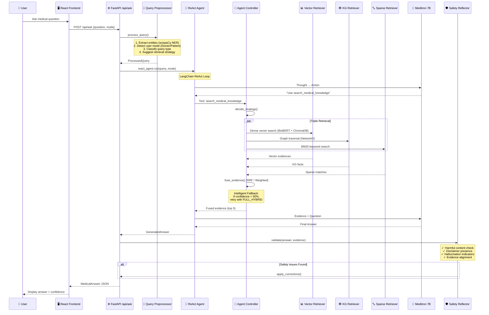
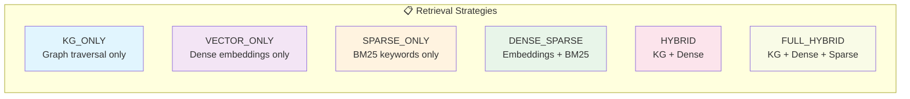
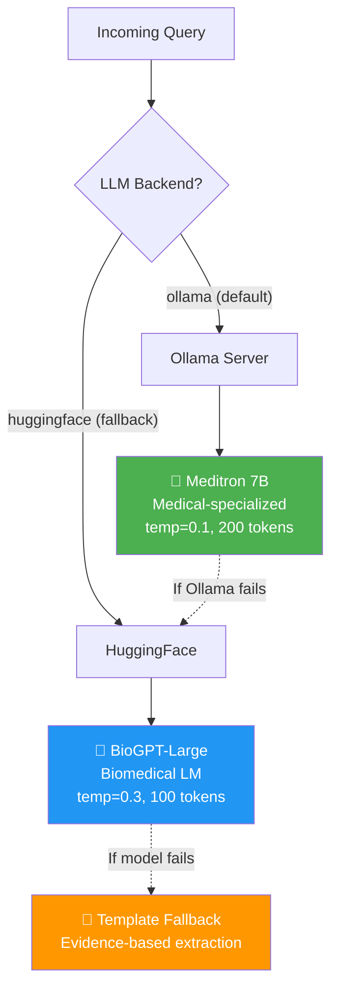

# Medical RAG QA System — Architecture Overview

> **Last Updated:** March 24, 2026  
> **Version:** 1.0.0  
> **Stack:** FastAPI · React · Meditron 7B · BioGPT · ChromaDB · NetworkX/Neo4j · LangChain

---

## High-Level Architecture



---

## Request Flow (Step by Step)



---

## Component Details

### 1. Query Preprocessor
| Feature | Details |
|---|---|
| **File** | [query_processor.py](file:///home/adhu/alefragnani.project-manager/medical-rag-qa/backend/preprocessing/query_processor.py) |
| **NLP Model** | scispaCy (`en_core_sci_md`), fallback to `en_core_web_sm` |
| **NER** | Medical entity extraction (Drugs, Diseases, Symptoms) |
| **UMLS Linking** | Optional UMLS concept mapping (disabled by default) |
| **Mode Detection** | Auto-classifies Doctor vs Patient based on keyword scoring |
| **Query Types** | `DEFINITION`, `CONTEXTUAL`, `COMPLEX` |
| **Strategy Mapping** | Definition → KG_ONLY · Complex → HYBRID · General → VECTOR_ONLY |

### 2. ReAct Agent (Primary)
| Feature | Details |
|---|---|
| **File** | [react_agent.py](file:///home/adhu/alefragnani.project-manager/medical-rag-qa/backend/agents/react_agent.py) |
| **Framework** | LangChain `create_react_agent` + `AgentExecutor` |
| **LLM** | **Meditron 7B** via Ollama (`meditron:7b`) |
| **Temperature** | 0.1 (very deterministic) |
| **Max Iterations** | 3 |
| **Tool** | `search_medical_knowledge` → triggers Agent Controller |
| **Fallback** | BioGPT via HuggingFace if Ollama unavailable |
| **Pattern** | Singleton (thread-safe) |

### 3. Agent Controller (Retrieval Orchestrator)
| Feature | Details |
|---|---|
| **File** | [agent_controller.py](file:///home/adhu/alefragnani.project-manager/medical-rag-qa/backend/agents/agent_controller.py) |
| **Strategy Selection** | Uses query type & entity count to choose strategy |
| **Evidence Fusion** | Reciprocal Rank Fusion (RRF) for Dense+Sparse, Weighted Fusion for others |
| **Intelligent Fallback** | Auto-retries with `FULL_HYBRID` if confidence < 50% |
| **Fusion Weights** | KG: 0.4 · Vector: 0.5 · Sparse: 0.1 |

### 4. Retrieval Strategies



| Strategy | Retrievers Used | Best For |
|---|---|---|
| `KG_ONLY` | NetworkX/Neo4j | Definition queries with known entities |
| `VECTOR_ONLY` | ChromaDB + BioBERT | General questions, semantic similarity |
| `SPARSE_ONLY` | BM25 | Exact keyword matching |
| `DENSE_SPARSE` | ChromaDB + BM25 | Balanced semantic + keyword |
| `HYBRID` | KG + ChromaDB | Complex queries with entities |
| `FULL_HYBRID` | KG + ChromaDB + BM25 | Fallback, max coverage |

### 5. Retrievers

#### Vector Retriever (Dense)
| Feature | Details |
|---|---|
| **File** | [vector_retriever.py](file:///home/adhu/alefragnani.project-manager/medical-rag-qa/backend/retrievers/vector_retriever.py) |
| **Embedding Model** | BioBERT (`biobert-base-cased-v1.2`) via SentenceTransformers |
| **Vector DB** | ChromaDB (PersistentClient, cosine similarity) |
| **Similarity Metric** | Cosine similarity (HNSW) |
| **Threshold** | 0.5 (configurable) |

#### Knowledge Graph Retriever
| Feature | Details |
|---|---|
| **File** | [kg_retriever.py](file:///home/adhu/alefragnani.project-manager/medical-rag-qa/backend/retrievers/kg_retriever.py) |
| **Primary Backend** | NetworkX `MultiDiGraph` (in-memory) |
| **Optional Backend** | Neo4j (if `NEO4J_ENABLED=true`) |
| **Knowledge** | Diseases, Symptoms, Drugs, Risk Factors, Complications |
| **Relations** | `HAS_SYMPTOM`, `TREATED_BY`, `TREATS`, `CAUSES`, `RISK_FACTOR`, `COMPLICATION` |
| **Confidence** | 0.9 (high confidence for structured facts) |

#### Sparse Retriever (BM25)
| Feature | Details |
|---|---|
| **File** | [sparse_retriever.py](file:///home/adhu/alefragnani.project-manager/medical-rag-qa/backend/retrievers/sparse_retriever.py) |
| **Algorithm** | BM25Okapi (rank-bm25) |
| **Persistence** | Pickle index (`data/bm25_index.pkl`) |
| **Tokenization** | Lowercase, punctuation removal (preserves hyphens) |

### 6. LLM Layer



| Model | Role | Params | Served By | Temperature |
|---|---|---|---|---|
| **Meditron 7B** | Primary agent LLM | 7B | Ollama (local) | 0.1 |
| **BioGPT-Large** | Fallback generator | 1.5B | HuggingFace Transformers | 0.3 |
| **FLAN-T5** | Alternative generator | Varies | HuggingFace Transformers | 0.3 |
| **GPT-4 / GPT-3.5** | Optional (API-based) | N/A | OpenAI API | Configurable |

### 7. Safety Reflector
| Feature | Details |
|---|---|
| **File** | [safety_reflector.py](file:///home/adhu/alefragnani.project-manager/medical-rag-qa/backend/safety/safety_reflector.py) |
| **Harmful Content** | Detects dosage recommendations, cure guarantees, anti-doctor advice |
| **Disclaimers** | Enforces medical disclaimers in Patient mode |
| **Hallucination Detection** | Flags uncertain language ("probably", "might be") |
| **Evidence Alignment** | Verifies drug names match retrieved evidence |
| **Auto-Correction** | Redacts harmful advice, adds disclaimers, reduces confidence |

### 8. Evaluation Module
| Feature | Details |
|---|---|
| **File** | [evaluator.py](file:///home/adhu/alefragnani.project-manager/medical-rag-qa/backend/evaluation/evaluator.py) |
| **Metrics** | BLEU, ROUGE-1/2/L, Faithfulness (Jaccard), Hallucination Rate |
| **Modes** | Single evaluation, Batch evaluation |
| **Dataset** | MedQuAD (Medical Question Answering Dataset) |

---

## Data Flow Summary

```
┌─────────────────────────────────────────────────────────────────────┐
│                         USER QUESTION                                │
│            "What are the symptoms of Type 2 Diabetes?"               │
└──────────────────────────┬──────────────────────────────────────────┘
                           │
                    ┌──────▼──────┐
                    │   PREPROCESS │
                    │              │
                    │ • NER: "Type │
                    │   2 Diabetes"│
                    │ • Mode: AUTO │
                    │   → PATIENT  │
                    │ • Type:      │
                    │   DEFINITION │
                    │ • Strategy:  │
                    │   KG_ONLY    │
                    └──────┬──────┘
                           │
                    ┌──────▼──────┐
                    │  ReAct AGENT │
                    │  (Meditron)  │
                    │              │
                    │ Thought: I   │
                    │ need to      │
                    │ search for   │
                    │ symptoms     │
                    └──────┬──────┘
                           │
                    ┌──────▼──────┐
                    │   RETRIEVE   │  ← Agent Controller
                    │              │
                    │ KG: Diabetes │
                    │  → HAS_SYMPTOM → IncreasedThirst
                    │  → HAS_SYMPTOM → FrequentUrination
                    │  → HAS_SYMPTOM → BlurredVision
                    │              │
                    │ Vector: Top 5│
                    │ similar docs │
                    └──────┬──────┘
                           │
                    ┌──────▼──────┐
                    │    FUSE      │
                    │              │
                    │ RRF / Weighted│
                    │ Fusion       │
                    │ Confidence:  │
                    │  0.85        │
                    └──────┬──────┘
                           │
                    ┌──────▼──────┐
                    │   GENERATE   │
                    │  (Meditron)  │
                    │              │
                    │ Final Answer │
                    │ based on     │
                    │ evidence     │
                    └──────┬──────┘
                           │
                    ┌──────▼──────┐
                    │   SAFETY     │
                    │   CHECK      │
                    │              │
                    │ ✓ No harmful │
                    │ ✓ Disclaimer │
                    │ ✓ Aligned    │
                    └──────┬──────┘
                           │
                    ┌──────▼──────┐
                    │   RESPONSE   │
                    │              │
                    │ answer: ...  │
                    │ confidence:  │
                    │  0.85        │
                    │ sources: []  │
                    │ safe: true   │
                    └─────────────┘
```

---

## Project Structure

```
medical-rag-qa/
├── backend/
│   ├── main.py                    # FastAPI app, endpoints, startup
│   ├── config.py                  # Settings (Pydantic), Agent config
│   ├── models/
│   │   └── __init__.py            # Pydantic models (MedicalQuery, MedicalAnswer, etc.)
│   ├── preprocessing/
│   │   └── query_processor.py     # scispaCy NER, mode detection, strategy suggestion
│   ├── agents/
│   │   ├── agent_controller.py    # Retrieval orchestration, RRF fusion, fallback
│   │   └── react_agent.py         # LangChain ReAct agent with Meditron
│   ├── retrievers/
│   │   ├── vector_retriever.py    # ChromaDB + BioBERT dense retrieval
│   │   ├── kg_retriever.py        # NetworkX/Neo4j knowledge graph
│   │   └── sparse_retriever.py    # BM25 sparse retrieval
│   ├── generators/
│   │   └── answer_generator.py    # Multi-backend LLM generation (Ollama/HF/OpenAI)
│   ├── safety/
│   │   └── safety_reflector.py    # Safety validation & auto-correction
│   ├── evaluation/
│   │   └── evaluator.py           # BLEU, ROUGE, Faithfulness, Hallucination metrics
│   └── utils/
│       ├── __init__.py            # Logger setup, exports
│       └── helpers.py             # Text cleaning, normalization
├── frontend/
│   ├── src/
│   │   ├── App.jsx                # Main chat interface with history
│   │   ├── api.js                 # Backend API client
│   │   ├── main.jsx               # React entry point
│   │   └── index.css              # Styles
│   ├── vite.config.js             # Vite bundler config
│   └── package.json               # Frontend dependencies
├── data/                           # MedQuAD dataset, BM25 index
├── vector_store/                   # ChromaDB persistent storage
├── models/                         # Local model files (BioBERT)
├── eval_results/                   # Evaluation output
├── run.py                          # Main entry point (uvicorn)
├── run_eval.py                     # Single evaluation runner
├── run_eval_batch.py               # Batch evaluation runner
├── docker-compose.yml              # Docker orchestration
└── requirements.txt                # Python dependencies
```

---

## API Endpoints

| Method | Endpoint | Description |
|---|---|---|
| `GET` | `/` | Root - system info |
| `GET` | `/api/health` | Health check + component status |
| `POST` | `/api/ask` | **Main endpoint** — ask a medical question |
| `POST` | `/api/preprocess` | Debug — preprocess query only |
| `GET` | `/api/stats` | Vector store & KG statistics |
| `GET` | `/docs` | Swagger UI |
| `GET` | `/redoc` | ReDoc API docs |

---

## Key Design Decisions

> [!IMPORTANT]
> **Triple Retrieval Architecture**: The system uses three complementary retrieval methods (Dense + Sparse + KG) with intelligent fusion, providing both semantic understanding and exact keyword matching alongside structured medical knowledge.

> [!TIP]
> **Graceful Degradation**: Every component has a fallback chain:
> - Meditron → BioGPT → Template extraction
> - scispaCy → en_core_web_sm → Regex NER
> - Neo4j → NetworkX (in-memory)
> - BioBERT → all-MiniLM-L6-v2

> [!WARNING]
> **Hallucination Prevention**: Multiple layers protect against hallucinations:
> 1. Evidence confidence threshold (25% minimum)
> 2. BioGPT word limit (30-40 words) to reduce fabrication
> 3. Safety reflector validates drug names against evidence
> 4. Auto-correction redacts unsupported medical claims

---

## Configuration Summary

| Variable | Default | Description |
|---|---|---|
| `LLM_BACKEND` | `ollama` | Primary LLM backend |
| `OLLAMA_MODEL` | `meditron:7b` | Ollama model name |
| `OLLAMA_BASE_URL` | `http://localhost:11434` | Ollama server URL |
| `LLM_MODEL` | `microsoft/BioGPT-Large` | HuggingFace fallback model |
| `EMBEDDING_MODEL` | `./models/biobert-base-cased-v1.2` | Embedding model |
| `LLM_TEMPERATURE` | `0.3` | Generation temperature |
| `LLM_MAX_TOKENS` | `512` | Max generation tokens |
| `TOP_K_VECTOR` | `5` | Dense retrieval top-k |
| `TOP_K_KG` | `3` | KG retrieval top-k |
| `SIMILARITY_THRESHOLD` | `0.5` | Minimum similarity score |
| `ENABLE_SAFETY_REFLECTION` | `true` | Enable safety checks |
| `NEO4J_ENABLED` | `false` | Use Neo4j instead of NetworkX |
